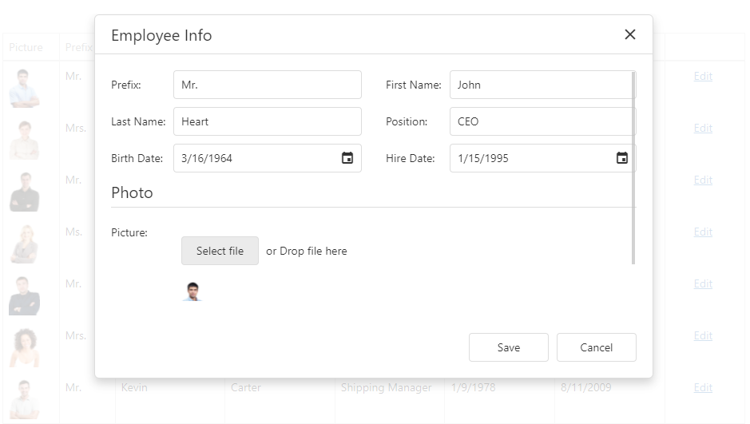

<!-- default badges list -->

<!-- default badges end -->
# DataGrid for DevExtreme - How to use FileUploader in the Edit Form

This example illustrates how to use [FileUploader](https://js.devexpress.com/Documentation/ApiReference/UI_Widgets/dxFileUploader/) in the [DataGrid's](https://js.devexpress.com/Documentation/ApiReference/UI_Widgets/dxDataGrid/) edit form. 

## Files to Review

- **jQuery**
    - [index.html](jQuery/src/index.html)
    - [index.js](jQuery/src/index.js)
- **Angular**
    - [app.component.html](Angular/src/app/app.component.html)
    - [app.component.ts](Angular/src/app/app.component.ts)
- **Vue**
    - [HomeContent.vue](Vue/src/components/HomeContent.vue)
- **React**
    - [App.tsx](React/src/App.tsx)
    - [FileUploaderEditor.tsx](React/src/FileUploaderEditor.tsx)
    - [FileUploaderWithPreview.tsx](React/src/FileUploaderWithPreview.tsx)
- **ASP.Net Core**    
    - [Index.cshtml](ASP.NET%20Core/ASP.NET%20Core/Views/Home/Index.cshtml)

## Implementation Details

The example consists of the backend service (BackendApp) and a client-side application (jQuery/Angular/React/Vue).

The **backend service** accepts POST requests from the [FileUploader](https://js.devexpress.com/Documentation/ApiReference/UI_Widgets/dxFileUploader/) component, saves uploaded images, and hosts static files.

The **client-side application** displays a page with the [DataGrid](https://js.devexpress.com/Documentation/ApiReference/UI_Widgets/dxDataGrid/) component. The `Picture` field in the grid contains image file names. The [cellTemplate](https://js.devexpress.com/Documentation/ApiReference/UI_Widgets/dxDataGrid/Configuration/columns/#cellTemplate) property allows you to display images in the column cells as illustrated in the [Column Template](https://js.devexpress.com/Demos/WidgetsGallery/Demo/DataGrid/ColumnTemplate/)  demo. Use the [editCellTemplate](https://js.devexpress.com/Documentation/ApiReference/UI_Components/dxDataGrid/Configuration/columns/#editCellTemplate) property to implement the file upload UI for the `Picture` field in the edit form.

##  How to Launch the Example

Open and run the `BackendApp` project in Visual Studio. Then, run the client-side application.

## Documentation

- [Getting Started with DataGrid](https://js.devexpress.com/Documentation/Guide/UI_Components/DataGrid/Getting_Started_with_DataGrid/)
- [Getting Started with File Uploader](https://js.devexpress.com/Documentation/Guide/UI_Components/FileUploader/)
<!-- feedback -->
## Does this example address your development requirements/objectives?

 

(you will be redirected to DevExpress.com to submit your response)
<!-- feedback end -->
